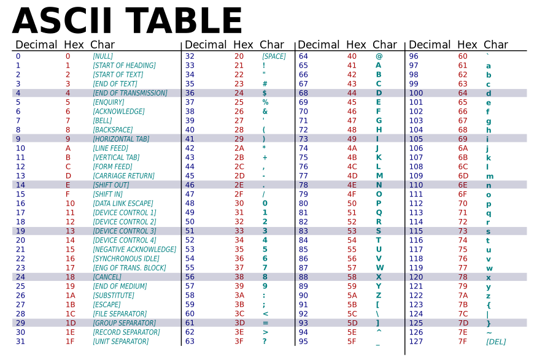

Le langage XSLT exploite massivement les requêtes exprimées avec XPath afin d’extraire de l’information dans des fichiers XML et de les enregistrer dans d’autres types de documents. Après un aperçu des possibilités offertes par le langage, vous vous lancerez dans la confection d’une feuille de transformation pour récupérer la version française de la chanson *The Highwayman* de Loreena McKennitt à partir d’un fichier TMX.

Comme toujours, avant de commencer, lancez [l’environnement en ligne](https://mybinder.org/v2/gh/Alex-bzh/python-M2ILTS/main).

## Aperçu de l’utilité des feuilles de transformation

Dans cette partie, vous allez simplement exécuter deux transformations successives d’un même fichier afin d’obtenir deux documents différents. Il s’agira de créer d’abord un fichier TSV (*Tabulation-Separated Values*) à partir du fichier *library.xml*, puis toujours du même document XML, produire une page HTML.

### De XML en TSV

Ouvrez une nouvelle fenêtre de terminal puis rendez-vous dans le répertoire *data*. À l’aide de l’utilitaire `xsltproc`, lancez la transformation du fichier *library.xml* (présent dans le répertoire *XML*) grâce à la feuille de transformation *library.xsl* (présente dans le répertoire *XSLT*) :

```bash
$ xsltproc XSL/library_to_tsv.xsl XML/library.xml
```

Le résultat de la transformation s’affiche tout naturellement dans la console. Redirigez maintenant le flux vers un fichier *library.tsv* :

```bash
$ xsltproc XSL/library_to_tsv.xsl XML/library.xml > library.tsv
```

Un fichier *library.tsv* vient d’apparaître dans le répertoire *data*. Ouvrez-le en effectuant un double-clic afin de voir le résultat de votre manœuvre.

### De XML en HTML

Le format HTML est un dérivé de XML spécialement conçu pour le Web. Il reprend l’idée des balises et des attributs sans la rigueur syntaxique du langage.

Exécutez la feuille *library_to_html.xsl* en veillant à rediriger le flux vers le sous-répertoire *library* à l’intérieur de *assets*, présent à la racine, et en nommant le fichier de destination *library.html* :

```bash
$ xsltproc XSL/library_to_html.xsl XML/library.xml > ~/assets/library/library.html
```

Avec un double-clic, ouvrez le fichier *library.html* et n’hésitez pas à regarder le code de la feuille de transformation afin d’en comprendre le mécanisme.

## De TMX en TXT

À présent, il est temps d’écrire votre propre feuille de transformation. L’objectif est de récupérer tous les segments français du fichier *highwayman.tmx* présent dans le répertoire *XML*.

### Préparation des fichiers

Grâce à l’interface graphique du *Binder*, déplacez-vous dans le répertoire *data* puis dans le sous-répertoire *XML*. Modifiez le fichier *highwayman.tmx* afin de lui ajouter une DTD :

```xml
<!DOCTYPE tmx SYSTEM "../DTD/tmx.dtd">
```

Ensuite, dans le sous-répertoire *XSL*, créez un nouveau fichier *get_fr_from_tmx.xsl* et collez le squelette minimal ci-dessous :

```xml
<?xml version="1.0" encoding="UTF-8"?>
<xsl:stylesheet version="1.0" xmlns:xsl="http://www.w3.org/1999/XSL/Transform">
  <!-- a TXT file -->
  <xsl:output method="text" encoding="utf-8" indent="yes"/>

  <!-- main template -->
  <xsl:template match="/">
    <!-- to remove if everything works perfectly -->
    <xsl:text>Version française de la chanson Highwayman&#10;</xsl:text>
  </xsl:template>

</xsl:stylesheet>
```

Pour vérifier que la feuille minimale est fonctionnelle, lancez la commande ci-dessous depuis le répertoire *data* :

```bash
$ xsltproc XSL/get_fr_from_tmx.xsl XML/highwayman.tmx
```

Vous devriez voir apparaître dans la console le texte suivant :*Version française de la chanson Highwayman*.

### Un premier template

**Objectif :** écrire un premier template et l’appliquer au document.

#### 1e étape

À la suite du template structurant, créez un nouveau template :

```xml
<!-- a new template -->
<xsl:template>
</xsl:template>
```

#### 2e étape

Faites en sorte que ce template matche l’expression XPath `seg` :

```xml
<xsl:template match="seg">
</xsl:template>
```

#### 3e étape

Ajoutez une instruction `value-of` qui demande au template d’afficher le contenu textuel d’un élément `seg` :

```xml
<xsl:template match="seg">
  <!-- print every character inside '<seg>' element -->
  <xsl:value-of select="."/>
</xsl:template>
```

#### 4e étape

À l’intérieur du template structurant, lancez un appel à tous les templates susceptibles de s’appliquer pour tous les éléments `seg` :

```xml
<!-- main template -->
 <xsl:template match="/">
  <!-- Call: which template is eligible to XPath '//seg' -->
  <xsl:apply-templates select="//seg"/>
</xsl:template>
```

Seul le template que vous avez créé aux étapes précédentes peut répondre à cet appel à candidatures car il matche l’expression XPath `seg`.

#### 5e étape

Appliquez le scénario de transformation et observez le résultat.

### Paramétrer une variable

**Objectif :** ajouter un retour chariot afin que chaque vers se place à la ligne

#### 1 étape

Trouvez dans la table ASCII quel est le code qui correspond au caractère *Line Feed* (`#10`) :



#### 2e étape

Créez une variable nommée *break*, juste après l’instruction `output` pour enregistrer le code du caractère *Line Feed* sous forme d’une entité (entre les balises `&` et `;`) :

```xml
<xsl:variable name="break" select="'&#10;'"/>
```

Notez que les guillemets simples indiquent au processeur que le code n’est pas une expression XPath mais du texte brut. 

#### 3e étape

Appelez cette variable dans le template dans le template `seg` de manière à générer un retour chariot après chaque vers :

```xml
<xsl:template match="seg">
  <xsl:value-of select="."/>
  <xsl:value-of select="$break"/>
</xsl:template>
```

Remarquez le `$` qui sert de préfixe lors des appels à une variable. Si vous appliquez de nouveau le scénario de transformation (toujours à partir du document XML et non pas à partir de la feulle de transformation), tous les vers sont à la ligne.

### Restreindre à la version française

**Objectif :** les vers sont certes alignés à gauche, mais leurs versions anglaise et française alternent sans distinction. Vous devez limiter la sélection du template aux seuls vers français. Pour cela, il est impératif de bien connaître la structure du document XML. À ce sujet, on observe que l’attribut `xml:lang` nous permettrait de distinguer les deux versions. En modifiant l'expression XPath de l’appel à candidatures on obtient :

```xml
<xsl:template match="/">
  <xsl:apply-templates select="//tuv[@xml:lang = 'fr']/seg"/>
</xsl:template>
```

Exécutez à nouveau la commande `xsltproc` dans le terminal et vous devriez voir le texte français de la chanson apparaître. N'hésitez pas à le rediriger vers un fichier texte :

```bash
$ xsltproc XSL/get_fr_from_tmx.xsl XML/highwayman.tmx > TXT/highwayman.fr.txt
```
